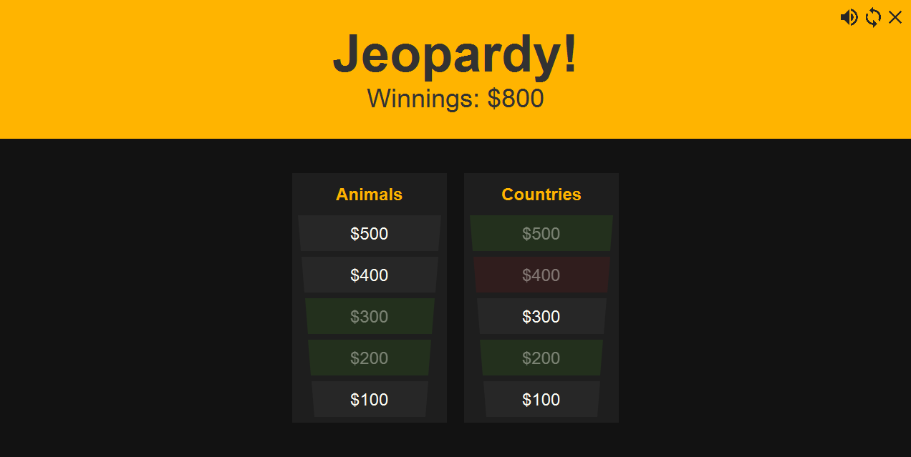
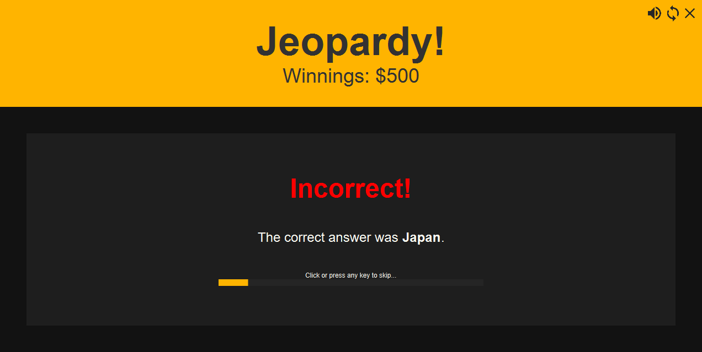

# Jeopardy!

A Java implementation of Jeopardy, created for SOFTENG 206 Assignment 2.

## Features

- Play user-defined categories and questions
- Amazing interface
- Cross-platform support
- Text-to-speech support for reading questions and saying answers (`espeak` must be in PATH)
- Resizable and draggable window
- Dynamic positioning of categories (try resizing the window)
- Mini-game inspired by the Chrome Dino game

## Categories & Questions

The game reads categories from a `./categories` folder (relative to the current working directory).

Inside this folder, there should be one or more files which are named as their category.
 Example: `./categories/animals` is the `animals` category.

Each file is in a CSV format without a header row. The format is `value,question,answer`.
 Example: `100,The national symbol of New Zealand,Kiwi`.

Changes to categories and questions will not be processed until the game is reset.

## Requirements

Java 8+
JavaFX (bundled with Java 8, [download](https://gluonhq.com/products/javafx/) required for Java 9+).

## Usage

Download the [latest compiled release](https://github.com/SOFTENG206-2020/assignment-2-DarkMatterMatt/releases/latest/download/jeopardy.jar).
Then run `java --module-path /path/to/javafx/lib/ --add-modules javafx.controls -jar jeopardy.jar`.
 
Don't have JavaFX? Check out [jfxRunner](https://github.com/DarkMatterMatt/jfxrunner/releases/latest), which seamlessly deals with JavaFX for you. Just run `java -jar jfxrunner.jar jeopardy.jar` (you might have to wait for a moment while JavaFX is downloaded!).

## Screenshots

Question selection menu

Answering a question

Whoops, wrong answer!

